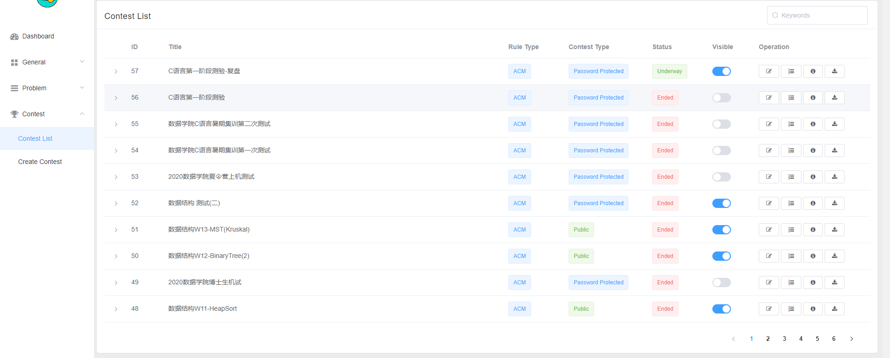
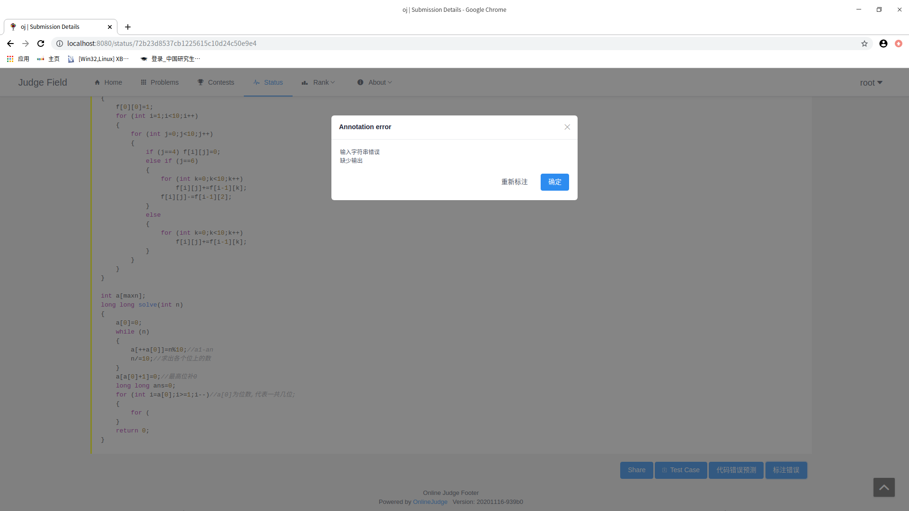
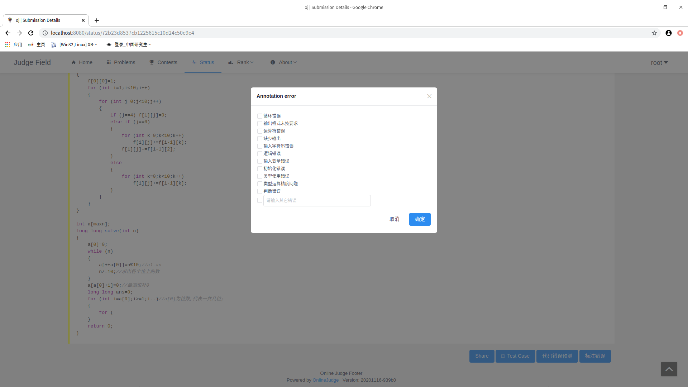

## OJ前后端开发需求

- [x] 1、学生在提交错误代码后可以手动标注错误类型

- [ ] 2、如果点击已经标注过错误类型，下次点击时会显示错误类型

- [ ] 3、为每个contest考试设置隐藏测试用例选项（涉及到的model有contest和submission）

  * 例如在下图管理员contest list页面加一列按钮，是否显示测试用例

    

  
  q2:
  目前已实现,实现方案:
  新增api用于查询某个submission的tags返回给前端
path:submission/urls/oj.py:
```java
url(r"^getAnnotationError/?$", getErrorAnnotationAPI.as_view(), name="getErrorAnnotation_api")
```
path:submission/views/oj.py:
```java
class getErrorAnnotationAPI(APIView):
    def get(self, request):
        if not request.GET.get("id"):
            return self.error("submissionId is needed")
        try:
            submission = Submission.objects.get(id=request.GET.get("id"))
        except Submission.DoesNotExist:
            return self.error("submission does not exist")
        res_tags = []
        for e in submission.tags.all():
            res_tags.append(SubmissionTagSerializer(e).data)
        return self.success(res_tags)
```
其中没有添加需要登录的注解,根据需要进行添加

前端根据返回的tags数组是否为空来判断这个submission是否已经标注,从而显示不同的模态框
已标注:

可以点击重新标注打开另外一个标注错误的模态框:
